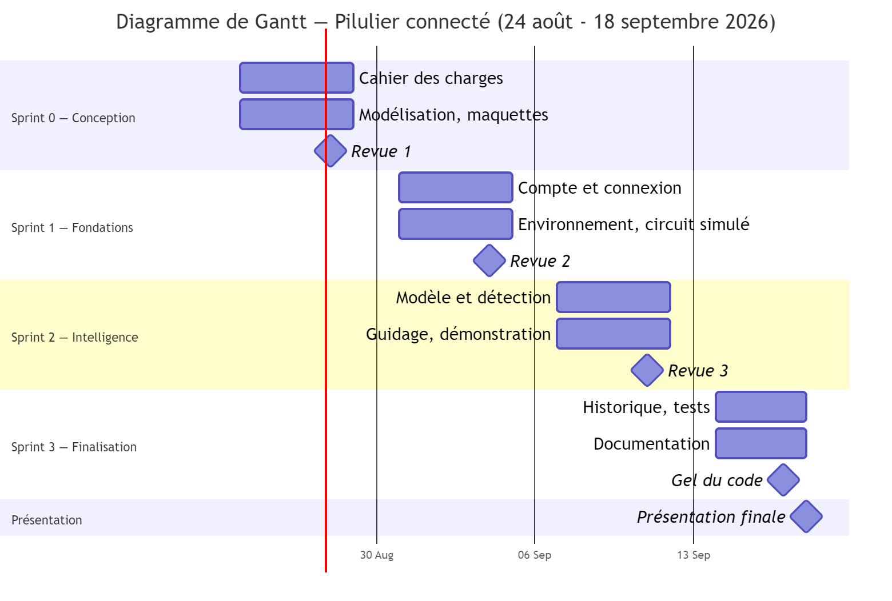

# Cahier des charges

Trois sections vivent dans leur propre fichier, parce que ce sont des livrables à part :

- section 2.1.3, la portée → [A1 · Périmètre](A1-perimetre.md)
- section 2.8, les risques → [A5 · Risques](A5-risques.md)
- l'analyse des besoins → [A2 · Analyse des besoins](A2-analyse-des-besoins.md)

## 2.1 INTRODUCTION

### 2.1.1 Contexte

**Le problème**
Beaucoup de gens ne prennent pas leurs médicaments comme prescrit. Ça cause des complications et des hospitalisations qu'on aurait pu éviter. Les plus touchés sont les personnes âgées et celles qui prennent des médicaments à plusieurs moments de la journée.

**Où le produit sert**
Chez le patient, plusieurs fois par jour, avec son téléphone. Il remplit son pilulier une fois par semaine. Le boîtier reste posé dans la cuisine ou sur la table de chevet.

**Pourquoi on le fait**
Des piluliers connectés existent déjà, mais ils ont tous le même défaut : ils détectent qu'une case a été ouverte, et c'est tout. L'Imedipac de Medissimo, vendu autour de 250 €, confirme l'ouverture mais pas la prise. Le Memo Box de TinyLogics apprend les habitudes du patient, mais son fabricant admet qu'il ne peut pas confirmer que le médicament a été avalé.

Une case ouverte par erreur, refermée sans rien prendre, ou ouverte par quelqu'un d'autre donne le même signal qu'une prise réussie. Les produits actuels mesurent une ouverture. Le patient veut savoir si le médicament est sorti.

### 2.1.2 Objectifs

Vérifier par image qu'un médicament a été retiré. Montrer au patient quelle case ouvrir, avec une lumière sur le boîtier. Calculer son adhérence sur des prises vérifiées, pas sur des ouvertures. Ne jamais trancher quand le système n'est pas sûr : il demande alors une vérification. Viser un coût de fabrication entre 50 et 80 $ CAD, sans moteur ni abonnement.

### 2.1.3 Portée

Voir [A1 · Périmètre](A1-perimetre.md).

### 2.1.4 Parties prenantes

**Client**
Il décide du périmètre, anime les séances de raffinement, peut refuser un besoin, et accepte ou refuse ce qu'on livre à chaque revue.

**Utilisateurs**
Les personnes qui suivent un traitement régulier, surtout celles qui prennent des médicaments à plusieurs moments dans la journée. Le public inclut des personnes âgées, ce qui change nos choix d'interface. Les proches aidants profiteraient du produit mais sont hors projet.

**Équipe**
Trois personnes. Le projet vient de nous, donc on est à la fois ceux qui le proposent et ceux qui le font.
Rauf Mifteev : backend, API, base de données, animation des rituels.
Daniel Alain Dyky : déploiement, intégration continue, circuit simulé, modèle, documentation technique.
Chahrazad Tayibi : application mobile, maquettes, design.
Le modèle est partagé : les trois prennent des photos, Daniel l'entraîne, Rauf le met en service, Chahrazad l'intègre.

**Autres**
Une équipe partenaire testera notre application à la fin et nous remettra une liste de bogues.

### 2.1.5 Terminologie

Adhérence : le pourcentage de prises faites par rapport aux prises prévues.
Case ou compartiment : une division du plateau. Elle correspond à un jour et à une rangée, pas à un médicament.
Rangée ou créneau : un des quatre moments de prise de la journée. Le patient lui donne une heure.
DEL adressable : une lumière qu'on peut allumer seule, même branchée en série avec d'autres.
ESP32 : un petit microcontrôleur avec Wi-Fi, courant dans les objets connectés.
Prise attendue : un moment où le patient doit prendre quelque chose. Elle a une heure et un statut.
Rétroéclairage : éclairer par en dessous pour que l'objet apparaisse en noir sur fond clair.
Statut « ambigu » : ce que le système répond quand il n'est pas assez sûr. Il demande alors une vérification.
Wokwi : un simulateur de circuits en ligne. Le code s'exécute pour de vrai et peut envoyer des requêtes.

## 2.2 DESCRIPTION GÉNÉRALE

### 2.2.1 Système actuel

Chez les utilisateurs visés, il n'y a pas de système. Ils utilisent un pilulier ordinaire, une alarme de téléphone, leur mémoire, ou un proche qui surveille. Rien de tout ça ne laisse de trace.

Les piluliers connectés du marché servent de référence. Ils détectent l'ouverture d'une case et rien de plus. Ils coûtent tous autour de 250 €, parfois avec un abonnement.

### 2.2.2 Le boîtier

Il mesure environ 22 × 12 × 6 cm, couvercle fermé. Le plateau contient 28 cases : 7 colonnes pour les jours, 4 rangées pour les moments de prise. Chaque case fait environ 3 × 2,5 × 2 cm.

Une case correspond à un jour et à une rangée, pas à un médicament. Les rangées n'ont pas d'heure fixe au départ : le patient donne une heure à chacune quand il configure son pilulier, puis il place chaque médicament dans la rangée qui correspond à son heure. Deux médicaments pris à des heures différentes ne vont jamais dans la même case. C'est ce qui permet de savoir si une prise a eu lieu au bon moment. Deux médicaments pris à la même heure vont ensemble : le système n'a pas besoin de les distinguer.

Le plateau a un seul couvercle, avec un seul interrupteur qui détecte la fermeture. Vingt-huit petits couvercles auraient voulu dire 28 charnières qui peuvent briser. Et un couvercle de 3 cm est difficile à ouvrir pour une personne âgée.

Vingt-huit DEL sont placées dans le couvercle, une par case. Elles se contrôlent avec un seul fil. Elles servent à éclairer au moment de la photo et à montrer au patient quelle case ouvrir.

Une seule caméra grand angle est placée dans la base, sous le plateau, tournée vers le haut. Les fonds des cases sont transparents. Avec un angle de 160°, une base de 3 cm suffit pour voir tout le plateau. Une caméra normale aurait demandé une potence de 21 cm au-dessus.

### 2.2.3 Comment le système détecte les prises

La photo se prend couvercle fermé, DEL allumées. Le comprimé apparaît comme une forme noire sur fond clair.

Ça donne trois avantages. Le contraste est très fort, bien plus qu'avec une photo en lumière normale où un comprimé blanc sur du plastique blanc est difficile à voir. La lumière de la pièce n'a plus d'effet : le boîtier est fermé et la seule lumière vient des DEL, alors toutes les photos se ressemblent. Et le modèle a juste à dire si une case est occupée ou vide, au lieu de reconnaître un objet dans des conditions qui changent.

Il n'y a aucun capteur dans les cases. Une seule photo montre les 28 en même temps. Le système la compare à la précédente et voit lesquelles se sont vidées. C'est plus fiable qu'un capteur : un capteur dit qu'un couvercle a bougé, la photo dit ce qui s'est vraiment passé. Elle voit une ouverture sans prise, ou une prise partielle. L'interrupteur sert seulement à déclencher la photo.

### 2.2.4 Ce que le patient fait

Il remplit son plateau une fois par semaine, puis confirme le remplissage dans l'application : c'est ce geste qui établit la photo de référence de la semaine, avant toute prise. À l'heure de la prise, la DEL de la bonne case s'allume et une notification arrive. Il ouvre, prend son médicament, referme. La fermeture déclenche la photo. Le système compare, voit la case vidée, confirme la prise, affiche le résultat et éteint la DEL. Le patient n'a aucune photo à prendre.

### 2.2.5 Fonctionnalités

Créer un compte et se connecter. Enregistrer ses médicaments. Donner une heure à chaque rangée, y placer ses médicaments et choisir les jours. Relier son pilulier à son compte. Confirmer le remplissage hebdomadaire du plateau. Recevoir une notification et voir la DEL s'allumer. Laisser le boîtier photographier à chaque fermeture. Recevoir un résultat par prise : confirmée, non prise, ou ambiguë. Confirmer soi-même quand c'est ambigu. Être prévenu d'une prise manquée. Consulter son historique et son adhérence. Voir l'état du circuit et provoquer une panne, sur un écran de démonstration.

### 2.2.6 Exigences non fonctionnelles

**Performance**
L'application ouvre en moins de 3 secondes. Un événement du couvercle apparaît en moins de 5 secondes. Le résultat arrive en moins de 10 secondes après la fermeture. Une photo est analysée en une fois pour les 28 cases. L'API accepte au moins trois boîtiers en même temps.

**Sécurité**
Les mots de passe sont hachés et ne circulent jamais en clair. On utilise des jetons pour l'authentification et le chiffrement pour toutes les communications, y compris celles du circuit. Un patient voit seulement ses données. Les photos appartiennent à un seul compte. Elles sont conservées 30 jours puis supprimées ; le verdict et le score de chaque vérification sont conservés indéfiniment, puisque l'historique et l'adhérence n'ont pas besoin des images pour rester valides. Aucune clé dans le dépôt. Les données sont validées dans l'application et sur le serveur.

**Ergonomie**
Le patient n'a aucune photo à prendre. La DEL lui évite de chercher une case parmi 28. On utilise ses mots, pas ceux des développeurs. Le tableau de bord montre les prises du jour sans navigation.

**Accessibilité**
Contrastes, taille du texte et zones à toucher selon les règles WCAG 2.1 niveau AA. Les statuts se distinguent autrement que par la couleur : chacun a une icône et un texte.

**Compatibilité**
iOS et Android, les deux dernières versions. L'API ne dépend pas de la source des images : remplacer le téléphone par une vraie caméra n'oblige à rien changer.

**Fiabilité**
Un événement reçu est sauvegardé avant d'être traité. Le système ne confirme jamais une prise sur une mauvaise photo. Le boîtier garde en mémoire ce qu'il n'a pas pu envoyer et le renvoie avec l'heure d'origine. Si le boîtier perd la connexion, le système le détecte et prévient le patient. Si le service d'analyse ne répond pas, l'application continue de fonctionner.

**Maintenance**
Une personne de l'extérieur doit pouvoir comprendre le projet et le démarrer avec le dépôt. On note les décisions d'architecture au moment où on les prend. Le seuil du modèle, les délais et la position des zones sont des paramètres, pas des valeurs écrites dans le code. Chaque partie technique a une note de départ dans le dépôt.

**Objet intelligent**
Le circuit envoie de vraies requêtes vers l'API : on ne simule rien côté serveur. Chaque événement contient l'identifiant du boîtier, le type et l'heure. L'API refuse tout événement d'un boîtier inconnu. La photo se prend couvercle fermé avec les DEL allumées, dans les mêmes conditions à chaque fois. Comme le plateau ne bouge pas, chaque case occupe toujours la même zone de l'image. On peut provoquer une panne depuis l'écran de démonstration.

### 2.2.7 Environnement

**Appareils**
Le téléphone du patient. Le boîtier, simulé sur Wokwi. Pour développer et tester : nos ordinateurs et nos téléphones.

**Plateformes**
iOS et Android, les deux dernières versions. Application en React Native, une seule base de code.

**Serveurs**
API en Node.js avec Express, déployée sur un service infonuagique gratuit. Base MongoDB Atlas. Service d'analyse séparé de l'API. Circuit simulé sur Wokwi, dans un navigateur.

Le boîtier et le téléphone ne se parlent jamais directement. Chacun parle au serveur. Le Bluetooth sert seulement à donner le mot de passe du réseau au boîtier, une fois, à l'installation.

**En cas de panne**
Téléphone déchargé : le boîtier continue d'enregistrer et la DEL continue de guider. Seule la notification manque, et le téléphone se met à jour au rallumage.
Réseau ou serveur coupé : le boîtier garde tout en mémoire et le renvoie avec l'heure d'origine.
Caméra ou modèle en panne : l'interrupteur sait quand même que le couvercle a été ouvert. L'application le dit et propose au patient de confirmer lui-même.

## 2.3 SPÉCIFICATIONS DÉTAILLÉES

### 2.3.1 Fonctionnalités

F1 — Compte et connexion
Description : le patient crée un compte avec un courriel et un mot de passe, puis se connecte.
Acteurs : Patient.
Résultat : le mot de passe est haché. Une connexion réussie ouvre le tableau de bord. Un identifiant erroné donne un message qui ne dit pas quel champ est fautif. Les routes protégées refusent une requête sans jeton.

F2 — Configuration du traitement
Description : le patient donne une heure à chaque rangée, enregistre ses médicaments et les place dans la bonne rangée.
Acteurs : Patient.
Résultat : les prises attendues sont créées pour sept jours. Deux médicaments pris à des heures différentes ne peuvent pas aller dans la même rangée. Maximum quatre heures différentes par jour.

F3 — Détection des ouvertures
Description : le boîtier signale au serveur chaque ouverture et fermeture du couvercle.
Acteurs : Circuit simulé.
Résultat : l'événement contient l'identifiant du boîtier, le type et l'heure. Un boîtier inconnu est refusé et noté. Un événement accepté est sauvegardé avant tout traitement.

F4 — Vérification par image
Description : à chaque fermeture, le boîtier photographie le plateau avec les DEL allumées. Le service d'analyse classe les 28 zones et compare à la photo précédente.
Acteurs : Circuit simulé.
Résultat : chaque case passée de pleine à vide devient une prise. Si le score est assez élevé, la prise est confirmée. S'il est trop bas, le résultat est « ambigu » et le système demande une vérification. Le résultat arrive en moins de 10 secondes.

F5 — Rappels et guidage
Description : à l'heure d'une prise, le système envoie une notification et allume la DEL de la case.
Acteurs : Tâche planifiée, Patient.
Résultat : la notification nomme le médicament et le moment. La toucher ouvre l'application sur la prise. La DEL s'éteint quand la prise est réglée.

F6 — Prises manquées
Description : le système marque comme manquées les prises dont la case n'a pas été vidée.
Acteurs : Tâche planifiée, Patient.
Résultat : après le délai, la prise passe à « manquée » et une alerte apparaît. Jamais deux alertes pour la même prise.

F7 — Historique et adhérence
Description : le patient consulte ses prises passées et son taux d'adhérence.
Acteurs : Patient.
Résultat : la liste va du plus récent au plus ancien, avec un statut par prise. Le taux des sept derniers jours s'affiche sur le tableau de bord. Rien ne peut être modifié ni supprimé.

F8 — Écran de démonstration
Description : un écran montre les événements reçus et permet de couper la connexion du boîtier.
Acteurs : Équipe, Patient.
Résultat : les événements s'affichent en direct. La panne se provoque sans manipulation technique. Rien n'est perdu et l'application reste utilisable.

F9 — Confirmation manuelle d'une prise ambiguë
Description : quand une prise est ambiguë, le patient indique lui-même s'il a pris son médicament ou non.
Acteurs : Patient.
Résultat : la prise passe à « confirmée » ou « manquée » selon la réponse du patient. Le système garde la trace qu'il s'agit d'une confirmation manuelle et non d'une vérification par image.

F10 — Confirmation du remplissage hebdomadaire
Description : après avoir rempli son plateau pour la semaine, le patient confirme le remplissage dans l'application avant la première prise.
Acteurs : Patient.
Résultat : le système prend une nouvelle photo de référence, qui n'est jamais comparée à la précédente : elle devient la nouvelle base de comparaison pour la semaine qui commence. Ce geste règle deux problèmes distincts : au tout premier démarrage, il n'existe autrement aucune photo antérieure à comparer ; et si une case reste vide après un remplissage (le patient a oublié d'y mettre un médicament), le système peut le signaler tout de suite plutôt que d'attendre une fausse « prise manquée » plus tard dans la semaine.

### 2.3.2 Scénarios

Les scénarios détaillés sont dans le document de modélisation. En résumé :

Première configuration. Le patient crée son compte, donne une heure à chaque rangée, enregistre ses médicaments et relie son pilulier.

Remplissage hebdomadaire. Le patient remplit son plateau pour la semaine et confirme le remplissage dans l'application. Cette confirmation établit la nouvelle photo de référence, avant toute prise.

Prise normale. La DEL s'allume, la notification arrive, le patient ouvre, prend, referme. La photo se déclenche, le système compare, la prise est confirmée.

Prise ambiguë. Le modèle hésite. Le système affiche « ambigu » et demande au patient de confirmer lui-même.

Prise manquée. Personne n'ouvre. Après le délai, la prise passe à « manquée » et une alerte apparaît.

### 2.3.3 Règles de gestion

RG-01 — Une case correspond à un jour et une rangée. Elle peut contenir plusieurs médicaments, mais seulement s'ils se prennent à la même heure.
RG-02 — Deux médicaments pris à des heures différentes ne peuvent pas aller dans la même rangée.
RG-03 — Une prise est confirmée seulement si la comparaison des photos montre la case vidée avec un score assez élevé, ou si le patient l'a confirmée lui-même. On garde la trace d'une confirmation manuelle.
RG-04 — Un événement d'un boîtier inconnu est refusé et noté.
RG-05 — Une prise dont la case n'a pas été vidée après le délai passe à « manquée ».
RG-06 — Une prise passe de « prévue » à « en vérification », puis à « confirmée », « manquée » ou « ambiguë ». Une prise réglée ne redevient jamais ambiguë.
RG-07 — On ne peut ni modifier ni supprimer une entrée de l'historique.
RG-08 — Le taux d'adhérence est le nombre de prises confirmées divisé par le nombre de prises prévues. Une prise ambiguë non réglée compte comme non confirmée.
RG-09 — Un compte est relié à un seul boîtier.
RG-10 — Un traitement ne peut pas avoir plus de quatre heures de prise différentes par jour.
RG-11 — Le système trouve les prises en comparant l'état du plateau avant et après une ouverture. Une case qui passe de pleine à vide correspond à une prise.
RG-12 — À l'heure d'une prise, la DEL de la case s'allume. Elle s'éteint quand la prise est confirmée ou manquée.
RG-13 — Une photo prise après une confirmation de remplissage est une photo de référence : elle n'est jamais comparée à la photo précédente, elle devient simplement la nouvelle base de comparaison. Tant qu'aucune photo de référence n'existe pour un boîtier, aucune comparaison n'est faite.

### 2.3.4 Traitements de données

À l'inscription, le mot de passe est haché avant d'être enregistré.

Quand le patient définit ses rangées et ses médicaments, le système crée les prises attendues pour les sept prochains jours.

Quand le patient confirme le remplissage hebdomadaire, le système prend une photo, l'enregistre comme photo de référence et ne la compare à aucune photo antérieure.

Quand une fermeture arrive, le système vérifie que le boîtier est connu, note l'heure, sauvegarde l'événement et la photo, puis envoie la photo au service d'analyse.

Le service découpe l'image en 28 zones connues, classe chacune en vide ou non vide avec un score, et compare aux 28 états de la photo précédente. Chaque case passée de pleine à vide devient une prise.

Une tâche s'exécute régulièrement pour trouver les prises dont le délai est dépassé et les marquer manquées.

Le taux d'adhérence est recalculé chaque fois qu'une prise change de statut.

### 2.3.5 Interfaces externes

Circuit vers API. Le boîtier envoie des requêtes HTTP avec son identifiant, le type d'événement, l'heure et la photo. Ce contrat reste valable si un vrai boîtier remplace la simulation.

API vers service d'analyse. L'API envoie une image, le service retourne 28 résultats avec leur score. Un faux service permet de développer l'application avant que le modèle existe.

Notifications. Les rappels sont planifiés sur le téléphone, pas envoyés par le serveur. Un patient sans réseau reçoit quand même son rappel.

Aucun lien avec un dossier médical, une pharmacie ou un professionnel de la santé.

### 2.3.6 Maquettes

[À INSÉRER — Écrans : inscription et connexion, tableau de bord du jour, configuration des rangées, liste des médicaments, résultat d'une prise avec ses trois états, historique, écran de démonstration.]

L'écran de résultat doit montrer les trois cas : prise confirmée, case encore pleine, résultat ambigu.

## 2.4 PLANIFICATION ET ORGANISATION

### 2.4.1 Méthodologie

On travaille en Scrum, avec des sprints d'une semaine. Le client joue le rôle de responsable de produit : il accepte ou refuse ce qu'on livre à chaque revue du vendredi.

Chaque sprint a un objectif écrit avant de commencer. On fait des mêlées tous les jours, une revue avec le client à la fin, et une rétrospective entre nous.

### 2.4.2 Ressources

Humaines : trois personnes.

Matérielles : nos ordinateurs, nos téléphones pour tester sur de vrais appareils, une connexion Internet. Aucun matériel électronique.

Logicielles : React Native, Node.js, Express, MongoDB Atlas, Wokwi, OpenCV, MobileNetV3-Small, Git et GitHub, GitHub Actions, Jira, un hébergement infonuagique. Tout est gratuit ou a un palier gratuit.

### 2.4.3 Responsabilités

Rauf Mifteev : backend, API, base de données, animation des rituels.
Daniel Alain Dyky : déploiement, intégration continue, circuit simulé, modèle, documentation technique.
Chahrazad Tayibi : application mobile, maquettes, design.
Le modèle est partagé : les trois prennent des photos, Daniel l'entraîne, Rauf le met en service, Chahrazad l'intègre.

### 2.4.4 Étapes et estimation

Le projet dure quatre semaines, avec une revue chaque vendredi.

Sprint 0, 24 au 28 août. Conception seulement, aucun code. Cahier des charges, modélisation, architecture, maquettes, carnet de produit, conventions d'équipe.

Sprint 1, 31 août au 4 septembre. Compte et connexion, configuration du traitement, environnement en ligne, circuit simulé qui envoie une vraie ouverture jusqu'à l'application.

Sprint 2, 7 au 11 septembre. Jeu de photos, entraînement du modèle, détection des prises, guidage lumineux, écran de démonstration avec panne.

Sprint 3, 14 au 18 septembre. Historique et adhérence, test croisé avec une autre équipe, correction des bogues, documentation, version finale et présentation.

Les récits sont estimés en points d'effort dans Jira, selon la suite 1, 2, 3, 5, 8, 13. La charge tourne autour de 25 à 30 points par sprint. C'est une hypothèse : on mesurera notre vitesse réelle à la fin du sprint 1 et on ajustera.

## 2.5 DIAGRAMME DE GANTT

*Figure — Planification des quatre sprints.*

Il doit montrer les quatre sprints avec leurs dates, les tâches principales, les dépendances, les jalons et le responsable de chaque tâche.

Dépendances à faire apparaître. La modélisation avant le carnet de produit, parce que les récits viennent des cas d'utilisation. L'environnement en ligne avant tout développement, parce qu'une fonctionnalité non déployée n'est pas livrée. Le jeu de photos avant l'entraînement du modèle. Le modèle avant la détection des prises.

Jalons. Les quatre revues : 28 août, 4, 11 et 18 septembre. Le gel du code la veille de la remise finale.

## 2.6 CRITÈRES D'ACCEPTATION ET DE VALIDATION

### 2.6.1 Validation

Chaque sprint finit par une revue devant le client. On démontre sur l'environnement en ligne. Une fonctionnalité qui marche seulement sur nos ordinateurs n'est pas considérée comme livrée.

Chaque récit est comparé à ses critères d'acceptation et à notre définition de « terminé ». On dit ce qu'on avait promis et ce qu'on a livré, même quand il y a un écart.

À la dernière semaine, une équipe partenaire teste l'application et nous remet une liste de bogues classés par priorité.

### 2.6.2 Tests

Tests unitaires sur les règles de gestion : détection des cases vidées, délai avant qu'une prise soit manquée, seuil du modèle, calcul de l'adhérence.

Tests d'intégration sur l'API : réception d'un événement, refus d'un boîtier inconnu, cycle complet d'une vérification.

Test de bout en bout : fermeture du couvercle, photo, comparaison, résultat, historique.

Tests des pannes : score trop bas, service d'analyse qui ne répond pas, perte de connexion.

Tests manuels sur un vrai téléphone, iOS et Android, à chaque sprint.

Évaluation du modèle sur des photos réservées, jamais utilisées pour l'entraînement. On mesure séparément les erreurs dans les deux sens. Confirmer une prise qui n'a pas eu lieu est l'erreur la plus grave.

Les tests sont écrits pendant le sprint, pas après. Ils s'exécutent à chaque intégration. Une intégration qui échoue n'est pas fusionnée.

### 2.6.3 Critères d'acceptation du produit

Un patient peut créer un compte, configurer ses rangées et ses médicaments, et recevoir un rappel à l'heure.

Une fermeture envoyée par le circuit simulé est reçue, enregistrée et visible dans l'application.

Le parcours complet, de la fermeture jusqu'au résultat, se démontre en direct sur l'environnement en ligne.

Un résultat ambigu déclenche une demande de vérification et pas un verdict. Le patient peut la régler.

On peut provoquer une panne et expliquer comment le système réagit.

L'historique et l'adhérence correspondent aux prises enregistrées.

L'intégration continue est au vert et les parcours importants sont couverts par des tests.

Le dépôt contient de quoi comprendre, démarrer et déployer le projet, et la déclaration des outils d'IA utilisés.

L'application est accessible en tout temps par une adresse publique.

## 2.7 MAINTENANCE ET ÉVOLUTION

**Corrections**
Les bogues signalés en revue ou par l'équipe partenaire sont notés dans le carnet et classés par priorité avec le client. Les bloquants sont corrigés avant la livraison. Chaque correction s'accompagne d'un test qui empêche le problème de revenir.

**Demandes d'évolution**
Toute demande passe par le carnet de produit. On l'inscrit, on l'estime, puis on l'arbitre avec le client à la séance suivante. On ne l'ajoute pas au sprint en cours.

**Documentation aux utilisateurs**
Un guide accompagne la livraison finale : comment configurer un traitement, comment se déroule une prise, comment lire son adhérence.

**Améliorations futures**
D'abord ce qu'on a écarté faute de temps : le partage du suivi avec un proche, la modification d'un médicament, le centre de notifications, l'adhérence médicament par médicament, la traduction.

Ensuite les plus grosses : remplacer le circuit simulé par un vrai boîtier, ce que notre contrat d'interface rend possible sans toucher au reste ; exporter l'historique pour un professionnel de la santé ; améliorer le modèle avec les photos réelles, si les utilisateurs y consentent ; gérer plusieurs boîtiers par compte.

## 2.8 GESTION DES RISQUES

Voir [A5 · Risques](A5-risques.md).
