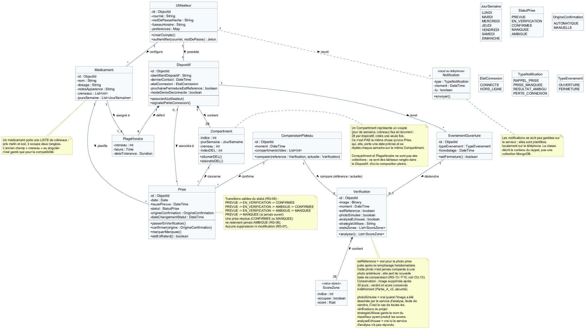

# Diagramme de classes

*Figure 2 — Modèle de données.*

Sept collections, et deux tableaux rangés dans le dispositif.

| Collection | Ce qu'elle contient |
|---|---|
| `utilisateurs` | Compte du patient, mot de passe haché, fuseau horaire, préférences |
| `dispositifs` | Le boîtier, son identifiant Wokwi, son état de connexion |
| `medicaments` | Nom, dosage, apparence, créneaux, jours de la semaine |
| `prises` | Une prise attendue : case, heure prévue, statut, origine de la confirmation |
| `evenementouvertures` | Ouverture ou fermeture du couvercle, avec l'heure |
| `verifications` | Une photo de plateau : image, moment, les 28 états et leurs scores |
| `comparaisonplateaus` | La comparaison de deux photos et la liste des cases vidées |

Les 28 `compartiments` (jour, créneau, numéro de la DEL) et les quatre `plagesHoraires` (créneau, heure, délai de tolérance) ne sont pas des collections : ce sont des tableaux rangés dans le dispositif, parce qu'ils n'existent jamais sans lui.

Les notifications ne sont pas gardées sur le serveur. Elles sont planifiées localement sur le téléphone.

### Points à retenir

Une case n'est pas liée à un médicament. Elle correspond à un jour et à un créneau.

Une `prise` porte l'identifiant du boîtier. Ce n'est pas obligatoire aujourd'hui, puisqu'un compte n'a qu'un boîtier, mais ça simplifie les requêtes et l'écran de démonstration.

Une `verification` est rattachée à l'`evenementOuverture` qui l'a déclenchée. C'est ce qui permet à l'écran de démonstration d'afficher l'événement et sa photo ensemble.

Une `verification` marquée comme référence n'est comparée à aucune photo précédente.
