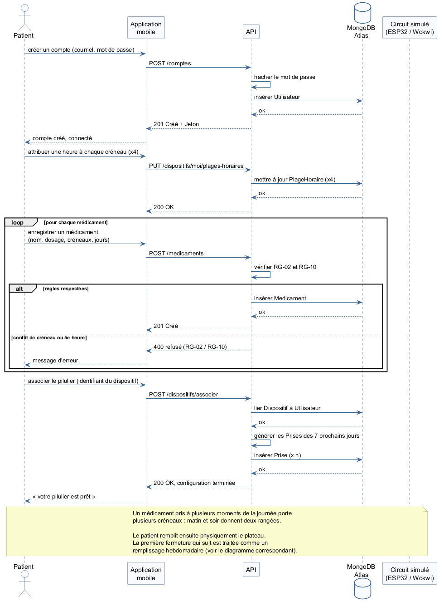
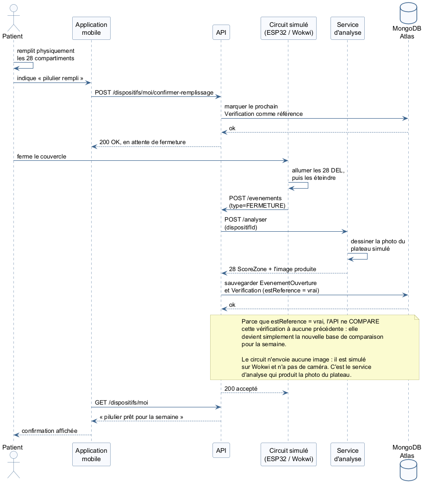
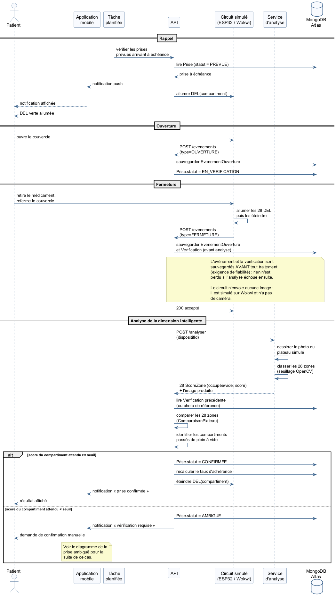
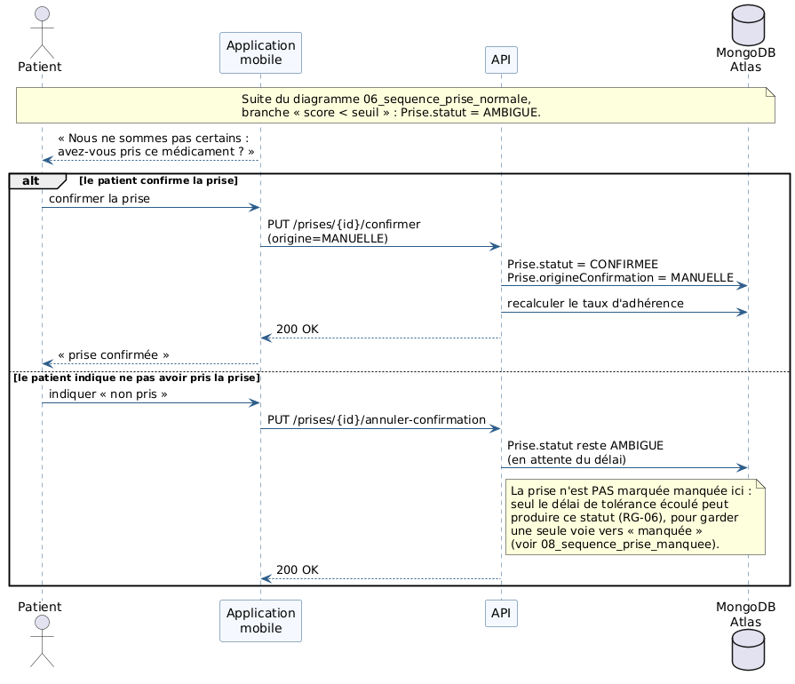
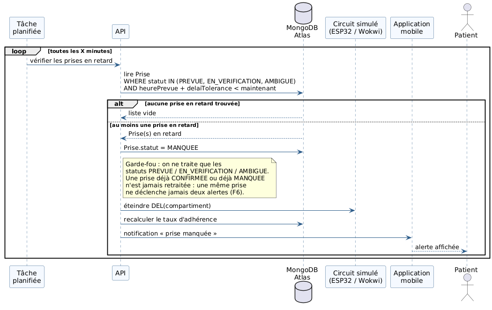

# Diagrammes de séquence

Cinq séquences. Les deux plus importantes pour la revue sont la prise normale, qui montre la chaîne complète du capteur jusqu'à l'écran, et la prise ambiguë, qui montre ce qui arrive quand le modèle se trompe.

## 1. Configuration initiale

*Figure 3 — Le patient configure son traitement.*

Le patient crée son compte, donne une heure à chaque créneau, enregistre ses médicaments et associe son pilulier. Le système crée les prises attendues des sept prochains jours.

## 2. Remplissage hebdomadaire

*Figure 4 — Le patient confirme son remplissage.*

Le patient confirme dans l'application. Le boîtier allume les DEL, prend la photo, éteint les DEL et envoie l'image. Le serveur marque cette photo comme référence : elle n'est comparée à rien. Il vérifie ensuite quelles cases devraient contenir un médicament cette semaine et signale celles qui sont vides.

## 3. Prise normale

*Figure 5 — Chaîne complète, du capteur jusqu'à l'écran.*

C'est la séquence à montrer en premier au client.

1. Le patient ferme le couvercle.
2. L'ESP32 allume les 28 DEL, prend la photo, les éteint.
3. Il envoie l'événement et l'image à l'API.
4. L'API vérifie que le boîtier est connu. Si non : refus et journalisation.
5. L'API sauvegarde l'événement et la photo avant tout traitement.
6. Le service d'analyse découpe l'image en 28 zones et classe chacune.
7. Il compare aux 28 états de la photo précédente.
8. Chaque case passée de pleine à vide devient une prise confirmée.
9. L'API éteint la DEL et l'application affiche le résultat.

## 4. Prise ambiguë

*Figure 6 — Le modèle hésite.*

Même début que la prise normale. À l'étape 8, le score est sous le seuil. Le système ne tranche pas : il met la prise à « ambigu » et demande une vérification au patient. Le patient confirme lui-même, et l'historique garde la trace que c'était manuel.

C'est la séquence qui répond à la quatrième question du client sur le comportement en cas d'erreur.

## 5. Prise manquée

*Figure 7 — Personne n'ouvre le couvercle.*

Aucune fermeture n'arrive. La tâche planifiée s'exécute, trouve une prise dont le délai est dépassé, la marque comme manquée, éteint la DEL et envoie une alerte. Elle ne le fait qu'une fois par prise.
