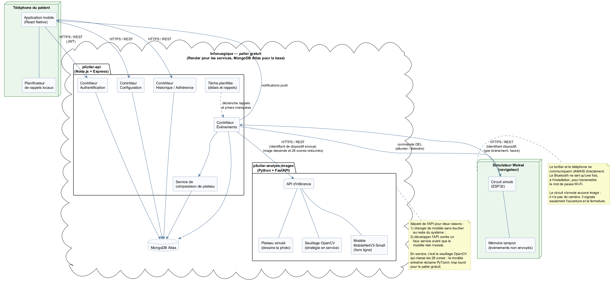

# Architecture logicielle

*Figure 8 — Les composants et leurs échanges.*

## Les composants

**Le boîtier.** Signale l'ouverture et la fermeture du couvercle, et garde en mémoire ce qu'il n'a pas pu envoyer. Il ne prend pas de photo : le circuit est simulé sur Wokwi et n'a pas de caméra. Il garde aussi une copie des heures des quatre créneaux, ce qui lui permet d'allumer la bonne DEL sans réseau.

**Le serveur.** Trois choses, déployées séparément : l'API REST (`pilulier-api`), le service d'analyse d'images (`pilulier-analyse-images`) et la base de données MongoDB Atlas. C'est lui qui garde les vraies données.

**Le téléphone.** Affiche les résultats et planifie les rappels. Il a une copie locale, mais rien d'unique.

## Les échanges

| De | Vers | Comment |
|---|---|---|
| Boîtier | API | HTTPS, avec l'identifiant du boîtier |
| API | Boîtier | HTTPS, pour les heures des créneaux et les DEL |
| Application | API | HTTPS avec jeton d'authentification |
| API | Service d'analyse | HTTPS : une image ou un identifiant de dispositif entre, 28 résultats sortent |
| API | Base de données | Pilote MongoDB |

Le boîtier et le téléphone ne se parlent jamais directement. Chacun parle au serveur.

Si le boîtier ne parlait qu'au téléphone, un téléphone déchargé voudrait dire aucune donnée enregistrée. Le patient prendrait ses médicaments et le système n'en saurait rien.

Le Bluetooth sert seulement à donner le mot de passe du réseau au boîtier, une fois, à l'installation.

## Pourquoi le service d'analyse est séparé

Deux raisons.

On peut changer le modèle sans toucher au reste du code.

On peut développer l'application avec un faux service qui retourne des résultats choisis, avant que le vrai modèle existe. Ça permet de travailler en parallèle.

## Comportement en panne

**Téléphone déchargé** — le boîtier continue d'enregistrer et la DEL continue de guider. Seule la notification manque. Le téléphone se met à jour au rallumage.

**Réseau ou serveur coupé** — le boîtier garde tout en mémoire et le renvoie plus tard avec l'heure d'origine.

**Service d'analyse en panne** — l'interrupteur sait quand même que le couvercle a été ouvert. L'application le dit et propose au patient de confirmer lui-même.

Les patrons de conception retenus sont dans [B6 · Patrons de conception](B6-patrons-conception.md).
