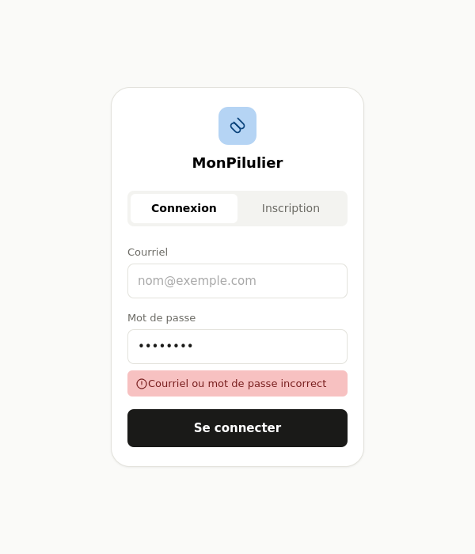
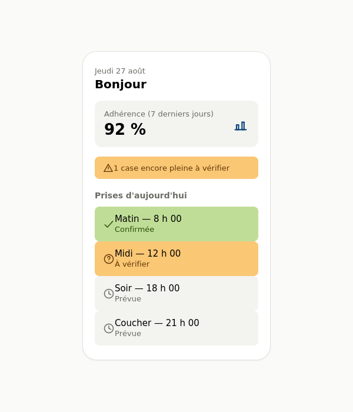
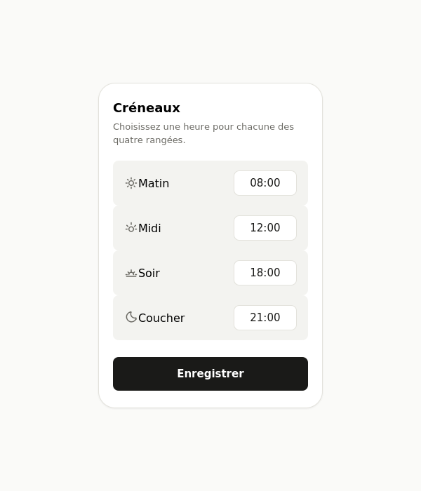
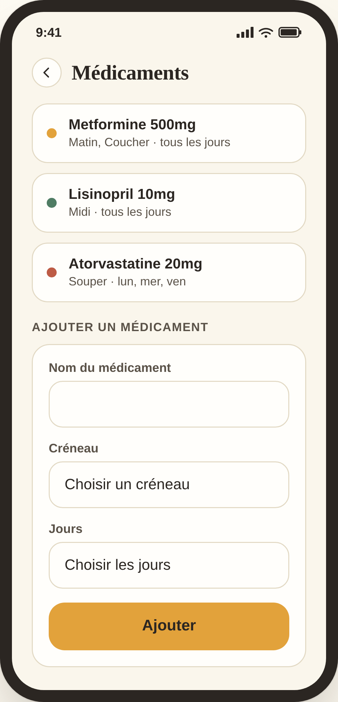
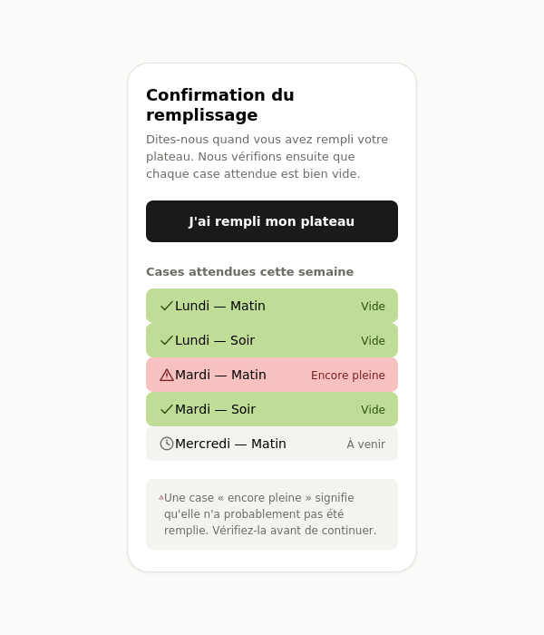
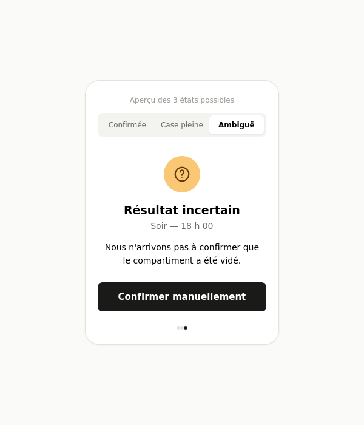
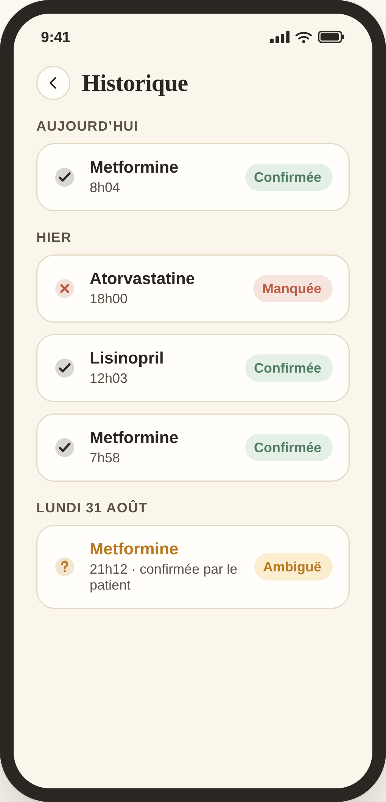
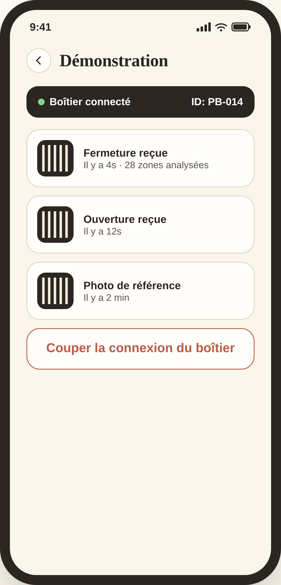

# Maquettes

Les maquettes reprennent celles du dossier précédent, mises à jour selon le périmètre retenu.

**Retirés** : les écrans du volet aidant, l'écran de paramètres séparé, l'écran d'adhérence par médicament, et les deux écrans de capture photo — le patient ne photographie plus rien.

## Les écrans

### 1. Inscription et connexion

Courriel et mot de passe. Message d'erreur qui ne dit pas quel champ est fautif.

### 2. Tableau de bord du jour

Les prises de la journée avec leur statut. Le taux d'adhérence des sept derniers jours. Les alertes en cours. C'est l'écran d'accueil : le patient voit ce qui l'intéresse sans naviguer.

### 3. Créneaux

Les quatre rangées et leur heure. Le patient choisit une heure pour chacune.

### 4. Médicaments

Liste des médicaments, formulaire d'ajout, choix du créneau et des jours.

### 5. Confirmation du remplissage

Le patient dit qu'il vient de remplir son plateau. L'écran montre ensuite les cases qui devraient contenir un médicament et qui sont vides.

### 6. Résultat d'une prise

Trois états à montrer :

- **Prise confirmée** — le médicament est sorti de la case.
- **Case encore pleine** — le médicament ne semble pas avoir été pris. On propose de recommencer.
- **Ambigu** — le système n'est pas sûr. Il demande au patient de confirmer.

C'est l'écran le plus important à montrer au client. Il prouve que le système ne tranche pas quand il doute.

### 7. Historique

Les prises passées, de la plus récente à la plus ancienne, avec leur statut. On ne peut rien modifier ni supprimer.

### 8. Écran de démonstration

Les événements reçus en direct, avec leur photo. Un bouton pour couper la connexion du boîtier. Écran réservé aux revues.

## Règles d'affichage

Contrastes, taille du texte et zones à toucher selon WCAG 2.1 niveau AA.

Chaque statut a une icône et un texte, pas seulement une couleur. Une personne qui distingue mal les couleurs doit pouvoir lire l'écran.

Zones à toucher larges. Le public visé inclut des personnes âgées.

On utilise les mots du patient. Aucun terme technique dans les écrans de tous les jours.
